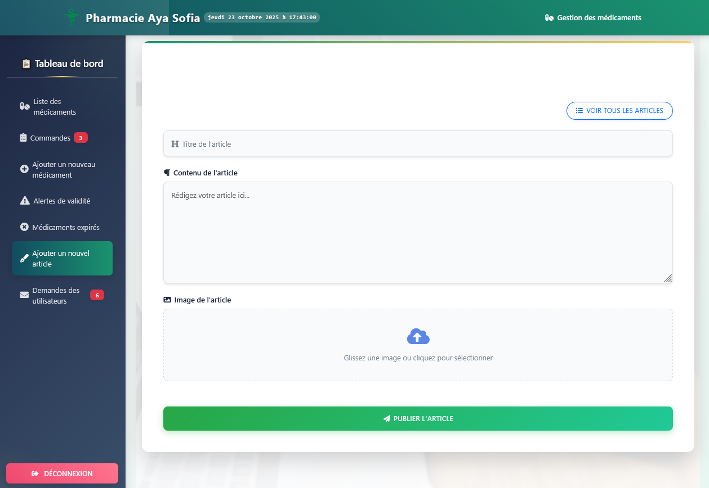

# Pharmacy Management System

A pharmacy management system developed with Laravel, MySQL, Bootstrap, CSS, and a bit of AJAX. 
The system allows pharmacists to manage medications, monitor stock and expiration, and handle customer orders efficiently.

## Key Features

- Pharmacist login page to manage medications.
- Real-time display of medications in the customer purchase page.
- Customers can send purchase requests that appear directly for the pharmacist.
- Alerts for medications nearing expiration.
- Ability to create awareness articles for customers about diseases and proper medications.
- Automated email requests to suppliers when medication stock runs out.

### Pharmacist Login Page

This page allows the **pharmacist to securely log in** using their **dedicated email and password**.

**Main functionalities:**
- Secure login form that requires:
  - **Email** 
  - **Password**
- Redirects the pharmacist to the **dashboard** upon successful login.
- Prevents unauthorized access — any incorrect credentials will show an error message:  
  `"Les identifiants de connexion sont incorrects."`
  
- Ensures that **only registered pharmacists** can access the inventory management, order processing, and article creation sections.

- Pharmacist login interface:  
  

### Pharmacist Dashboard

This is the first page that appears after the pharmacist logs in.  
It provides a complete overview of the medications previously added by the pharmacist and allows the following actions:

- View the list of all medications.
- Edit or delete any medication.
- See alerts for medications that are expiring soon (within 30 days or less).
- Use the search bar to quickly find medications by name or price.

### Orders Management Page

This page allows the pharmacist to view and manage all the medication orders sent by customers.  
Each order contains detailed information, including:

- The customer’s full name, address, and phone number.  
- The list of ordered medications.  
- A required medical prescription (for controlled or dangerous medications).  
- The possibility for the pharmacist to **accept** or **reject** the order after contacting the customer.

Once an action is taken, the order status is updated accordingly in the system.

### Add Medication Page

This page allows the pharmacist to **add new medications** to the system so that they become visible to customers.  
Each medication entry includes:

- The medication name, category, and description.  
- The expiration date and quantity in stock.  
- The supplier’s email address — this information will be used later when the pharmacist needs to send a **restock request** directly to the supplier.

Once the form is submitted, the new medication automatically appears on the customer purchase page.

### Near Expiry Medications Page

This page displays a **list of all medications that are close to their expiration date** (30 days or less).  
It allows the pharmacist to easily monitor which products need attention.

**Main functionalities:**
- Automatic listing of near-expiry medications.  
- Simple and clean interface for quick overview.  
- Real-time update when the stock reaches zero (medication no longer appears in the alert).

This feature helps maintain patient safety and ensures the pharmacy always provides valid products.

### Out of Stock Medications Page

This page lists **all medications that are officially out of stock**.  
It helps the pharmacist quickly identify which products need to be restocked.

**Main functionalities:**
- Displays the **name of each medication**, its **previous expiration date**, and the **quantity to reorder**.  
- Allows the pharmacist to specify how many units to order.  
- A button **"Envoyer la demande"** sends the order request directly to the supplier’s email.  
- The supplier receives an **automatic email** with all medication details and quantities requested.

This feature simplifies the communication between the pharmacist and suppliers, ensuring fast restocking and continuous availability of medicines.

- Pharmacist view:  
  

- Supplier email view:  
  

### Health Articles Management Page

This section allows the **pharmacist to create and manage health awareness articles**.  
These articles aim to inform customers about common diseases, **methods of prevention**, and **recommended medications**.

**Main functionalities:**
- The pharmacist can **add, edit, or delete** articles easily.  
- By clicking **"Voir tous les articles"**, all published articles are displayed in a list for management.  
- Each article includes a **title, description, and optional image**.  
- All published articles appear **automatically on the main customer homepage**, at the bottom section.

This feature enhances communication between the pharmacist and the customers, promoting health education and awareness.

- Article management interface :  
  

- Articles that can be deleted or edited :
  

### Customer Inquiries Management Page

This page allows the **pharmacist to receive and manage inquiries** sent by customers.  
Customers can use the contact form to ask questions about medications, prescriptions, or any related topic.

**Main functionalities:**
- Displays a **list of received inquiries** with:
  - Customer **name**
  - **Email address**
  - **Phone number**
  - **Message content**
  - **Date and time** the inquiry was received  
- The pharmacist can click **"Voir"** to open the message in detail.
- From there, the pharmacist can **reply directly via Gmail** or **contact the customer by phone**.

This page helps maintain communication between the pharmacist and customers, ensuring professional and responsive service.

- Pharmacist inquiry management interface:  
  
- After pressing "Voir"
  